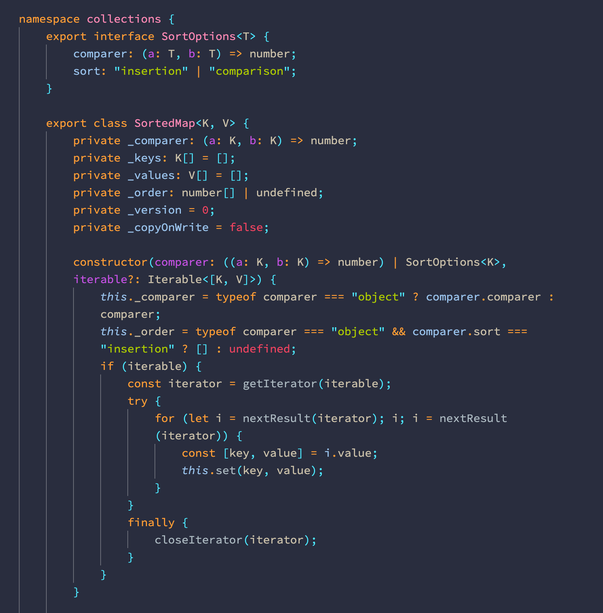
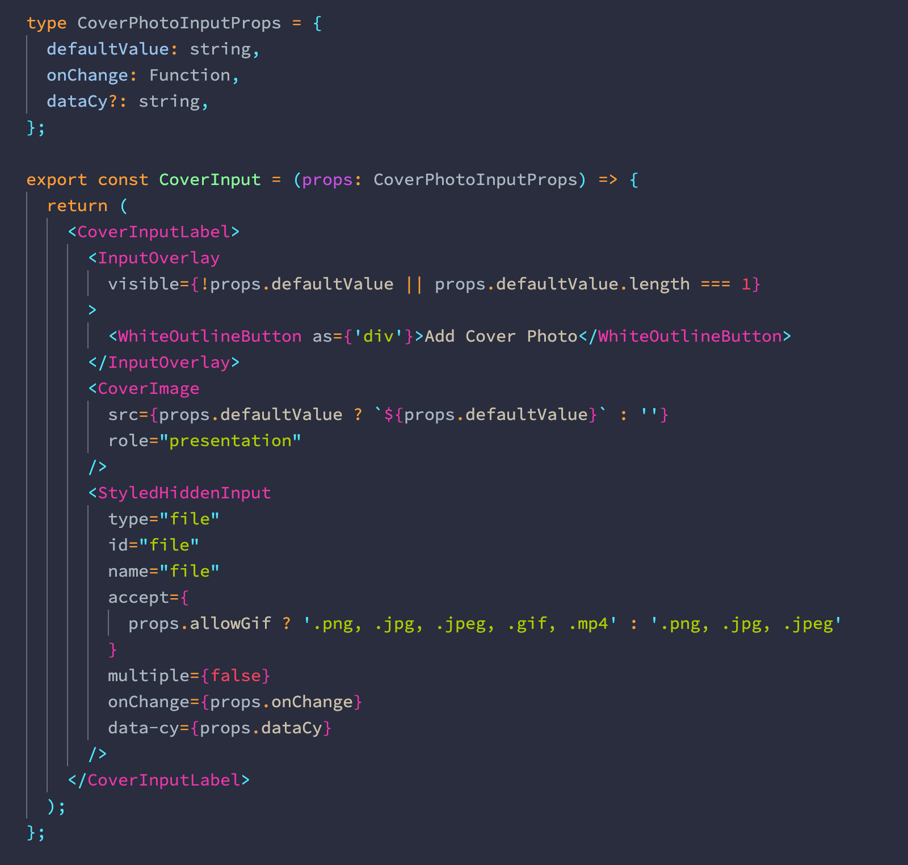
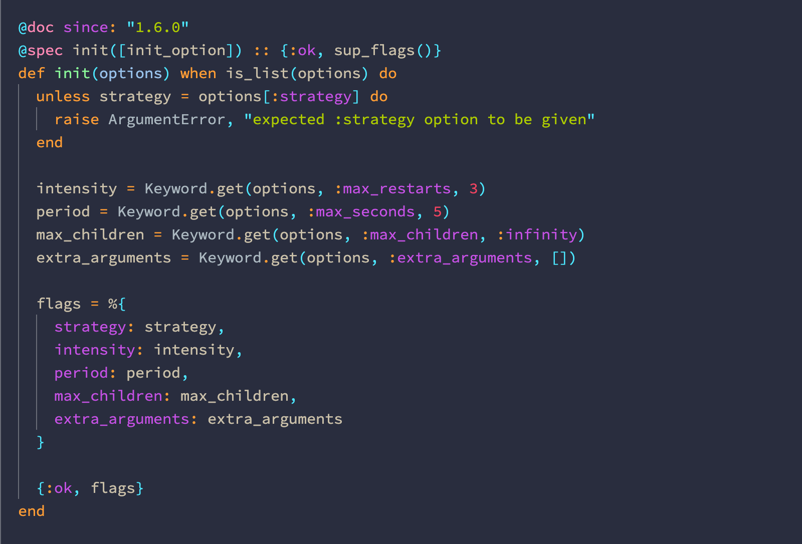
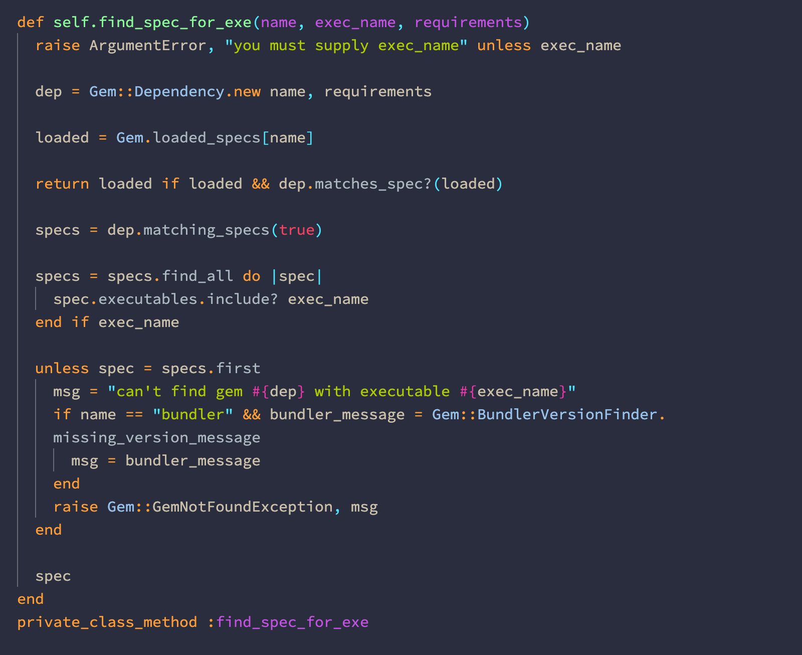
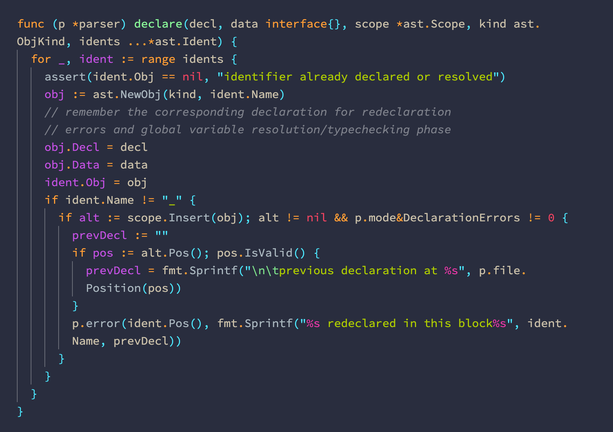
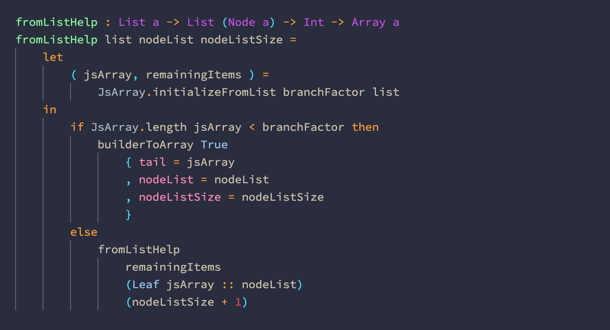
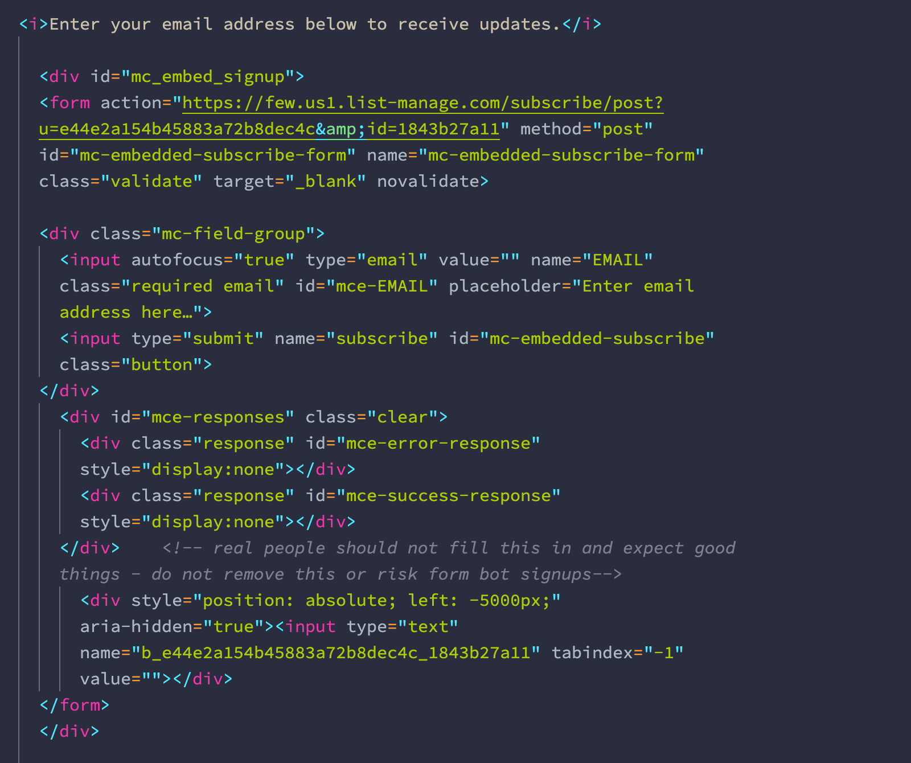
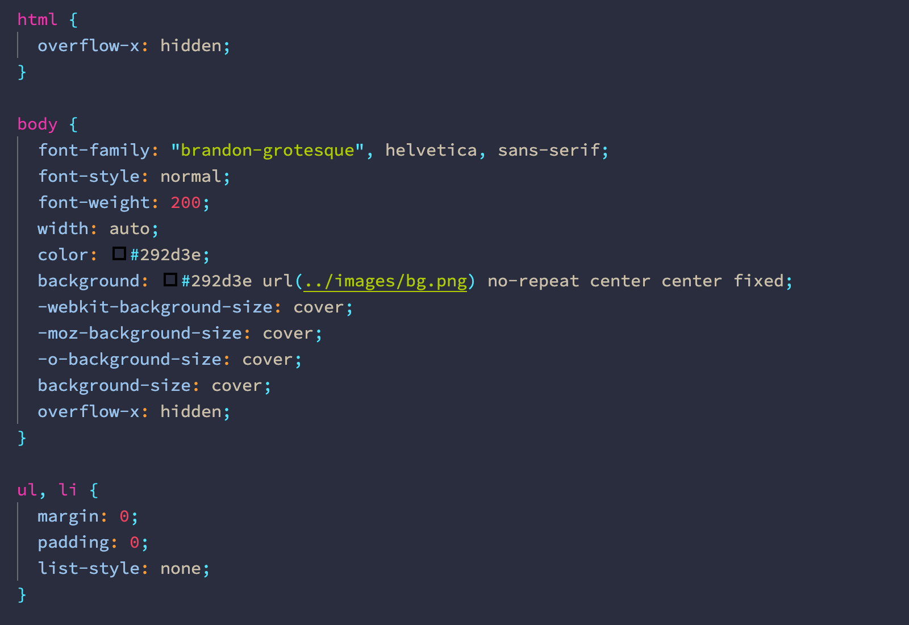
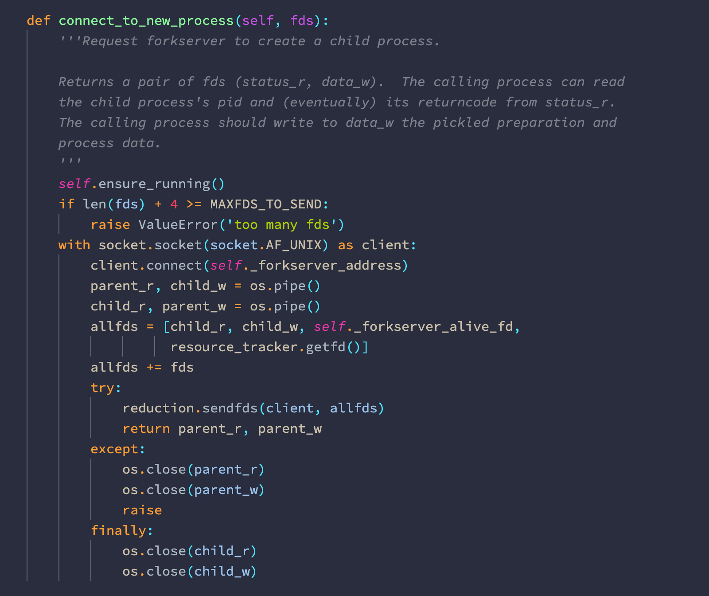
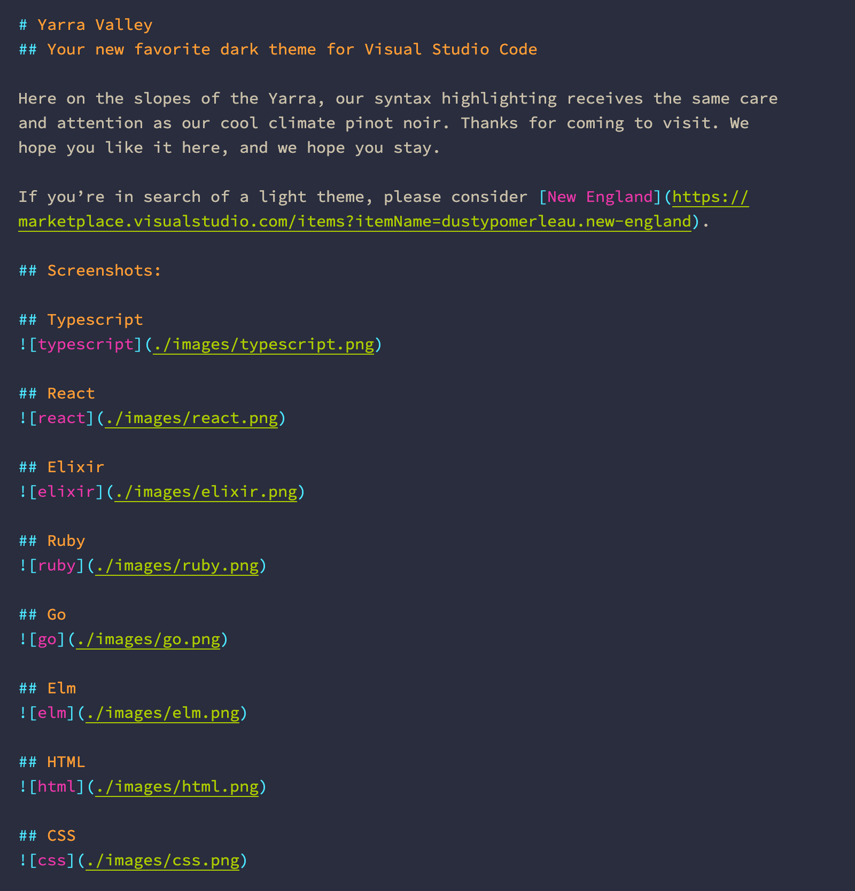

# Yarra Valley
## Your new favorite dark theme for Visual Studio Code

Here on the slopes of the Yarra, our syntax highlighting receives the same care and attention as our cool climate pinot noir. Thanks for coming to visit. We hope you like it here, and we hope you stay.

**NOTE:** If your code doesn't look as expected, you may have VS Code's semantic highlighting enabled. This is layered on top of the syntax highlighting of your theme, and can be disabled in your `settings.json` file:

```json
 "editor.semanticHighlighting.enabled": false
```

In addition, some extensions may enable their own semantic highlighting. In order to see the intended theme colors, this can also be disabled at the extension level. For example, when using C/C++ Intellisense:

```json
  "C_Cpp.enhancedColorization": "disabled"
```

## Screenshots:

## Typescript


## React


## Elixir


## Ruby


## Go


## Elm


## HTML


## CSS


## Python


## Markdown


## Supported languages and extensions:

- AsciiDoc ([AsciiDoc][])
- C ([C/C++][])
- C# ([C#][])
- C++ ([C/C++][])
- Clojure
- Crystal ([Crystal Language][])
- CSS
- Dart ([Dart Code][])
- Elixir ([ElixirLS Fork][])
- Elm ([Elm][])
- Erlang ([erlang][])
- Go ([Go][])
- GraphQL ([GraphQL][])
- Haskell ([Haskell Syntax Highlighting][])
- HTML
- Java ([Java Extension Pack][])
- JavaScript ([Babel JavaScript][])
- LaTeX ([LaTeX Workshop][])
- Lua ([Lua][])
- Markdown
- PHP
- Python ([Python][])
- R ([R][])
- Reason ([reason-vscode][] or [OCaml and Reason IDE][])
- Ruby ([Ruby][] + [VSCode Ruby][])
- Rust ([Rust (rls)][])
- shell script
- SQL
- Swift ([Swift Language][])
- TypeScript

<!--
## Planned languages:

- F#
- Gleam
- Idris
- Julia
- Kotlin
- Objective-C
- OCaml
- Perl
- Pony
- reStructuredText
- Scala
- Scheme
- TLA+
- YAML
-->

[AsciiDoc]: https://marketplace.visualstudio.com/items?itemName=joaompinto.asciidoctor-vscode
[Babel JavaScript]: https://marketplace.visualstudio.com/items?itemName=mgmcdermott.vscode-language-babel
[C/C++]: https://marketplace.visualstudio.com/items?itemName=ms-vscode.cpptools
[C/C++]: https://marketplace.visualstudio.com/items?itemName=ms-vscode.cpptools
[C#]: https://marketplace.visualstudio.com/items?itemName=ms-dotnettools.csharp
[Crystal Language]: https://marketplace.visualstudio.com/items?itemName=faustinoaq.crystal-lang
[Dart Code]: https://marketplace.visualstudio.com/items?itemName=Dart-Code.dart-code
[ElixirLS Fork]: https://marketplace.visualstudio.com/items?itemName=elixir-lsp.elixir-ls
[Elm]: https://marketplace.visualstudio.com/items?itemName=Elmtooling.elm-ls-vscode
[erlang]: https://marketplace.visualstudio.com/items?itemName=pgourlain.erlang
[Go]: https://marketplace.visualstudio.com/items?itemName=ms-vscode.Go
[GraphQL]: https://marketplace.visualstudio.com/items?itemName=Prisma.vscode-graphql
[Haskell Syntax Highlighting]: https://marketplace.visualstudio.com/items?itemName=justusadam.language-haskell
[Java Extension Pack]: https://marketplace.visualstudio.com/items?itemName=vscjava.vscode-java-pack
[LaTeX Workshop]: https://marketplace.visualstudio.com/items?itemName=James-Yu.latex-workshop
[Lua]: https://marketplace.visualstudio.com/items?itemName=sumneko.lua
[OCaml and Reason IDE]: https://marketplace.visualstudio.com/items?itemName=freebroccolo.reasonml
[Python]: https://marketplace.visualstudio.com/items?itemName=ms-python.python
[R]: https://marketplace.visualstudio.com/items?itemName=Ikuyadeu.r
[reason-vscode]: https://marketplace.visualstudio.com/items?itemName=jaredly.reason-vscode
[Ruby]: https://marketplace.visualstudio.com/items?itemName=rebornix.Ruby
[Rust (rls)]: https://marketplace.visualstudio.com/items?itemName=rust-lang.rust
[Swift Language]: https://marketplace.visualstudio.com/items?itemName=Kasik96.swift
[VSCode Ruby]: https://marketplace.visualstudio.com/items?itemName=wingrunr21.vscode-ruby
